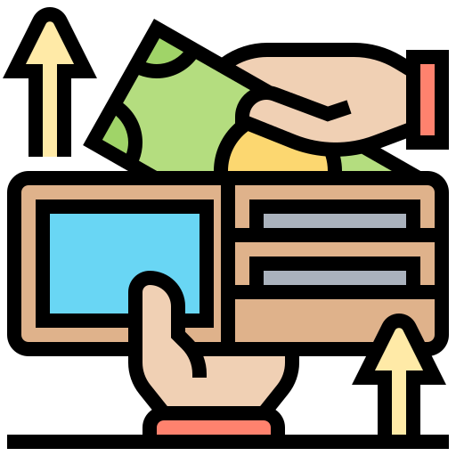

# ExpenTrack - Personal Finance Management App

ExpenTrack is a user-friendly and intuitive personal finance tool that empowers you to take control of your finances. With just a few taps, you can easily track and record your income and expenses, categorize transactions, generate detailed reports, and visualize your financial activity for better understanding and analysis.

## Introduction

Managing personal finances can be challenging, but with ExpenTrack, you can simplify the process. Whether you want to track your monthly expenses, monitor income streams, or analyze your spending habits, this app has got you covered. Stay in control of your finances and make informed decisions with ExpenTrack.

## Features

- **Effortless Tracking:** Record your income and expenses with just a few taps, making it easy to stay on top of your financial transactions.

- **Categorization:** Categorize your transactions to gain insights into your spending patterns and identify areas where you can save.

- **Detailed Reports:** Generate comprehensive reports that provide a clear overview of your financial activity and help you make informed decisions.

- **Visualizations:** Visualize your financial data through graphs and charts, making it easier to understand your spending trends.

- **Seamless CRUD Operations:** Enjoy a smooth user experience with seamless Create, Read, Update, and Delete operations for income and expenses.

## Getting Started

### Installation

To get started with ExpenTrack, follow these simple steps:

1. Clone the repository: `git clone https://github.com/KamleshChandel04/expen-track.git`
2. Navigate to the project directory: `cd expen-track`
3. Install the required dependencies: `npm install`
4. Start the development server: `npm start`

### Usage

Once the development server is up and running, access ExpenTrack through your web browser at `http://localhost:3000`. Create an account, log in, and start managing your finances effortlessly.

